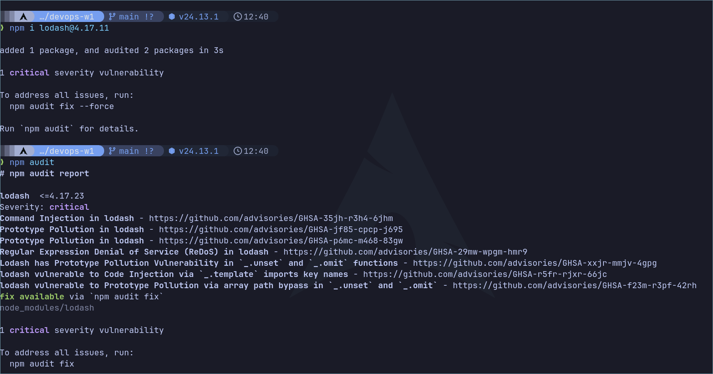
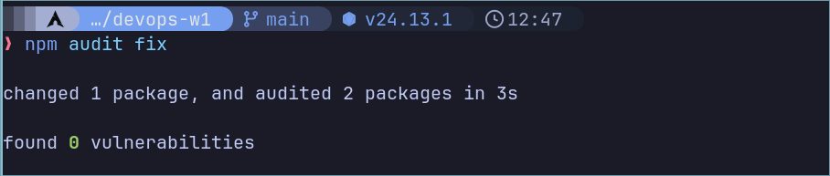
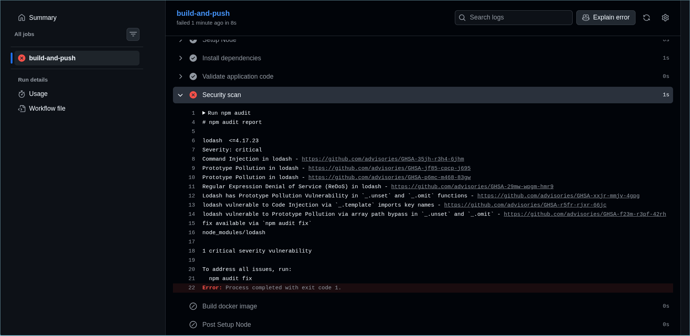
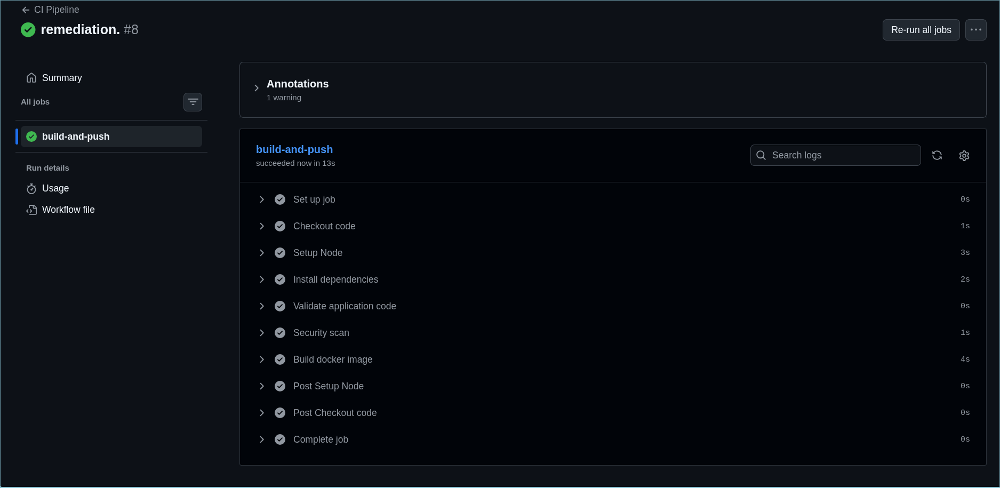

# devops-w1

## Docker Hub image

This project publishes its Docker image automatically via GitHub Actions to Docker Hub:

- https://hub.docker.com/r/afanfondu/devops-w1

You can run the published image with:

```bash
docker run -p 3000:3000 afanfondu/devops-w1
```

## Screenshot

Example build and run output:


## DevSecOps Assignment Deliverables

GitHub repository:

- https://github.com/afanfondu/devops-w1

Updated CI/CD pipeline configuration:

- [`.github/workflows/ci.yml`](.github/workflows/ci.yml)
- The pipeline installs dependencies, validates the app, runs `npm audit`, and builds the Docker image.

Evidence:

### Vulnerability detection



### Successful remediation



### Pipeline failure due to security issue



### Pipeline success after resolution


