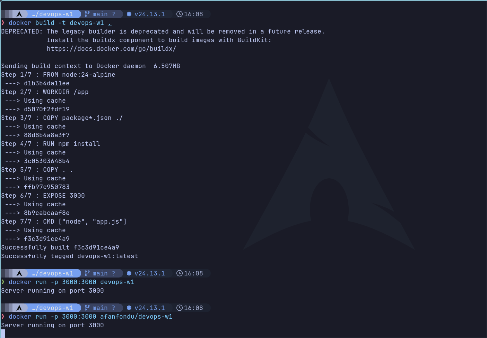

# devops-w1

## Docker Hub image

This project publishes its Docker image automatically via GitHub Actions to Docker Hub:

- https://hub.docker.com/r/afanfondu/devops-w1

You can run the published image with:

```bash
docker run -p 3000:3000 afanfondu/devops-w1
```

## Screenshot

Example build and run output:


